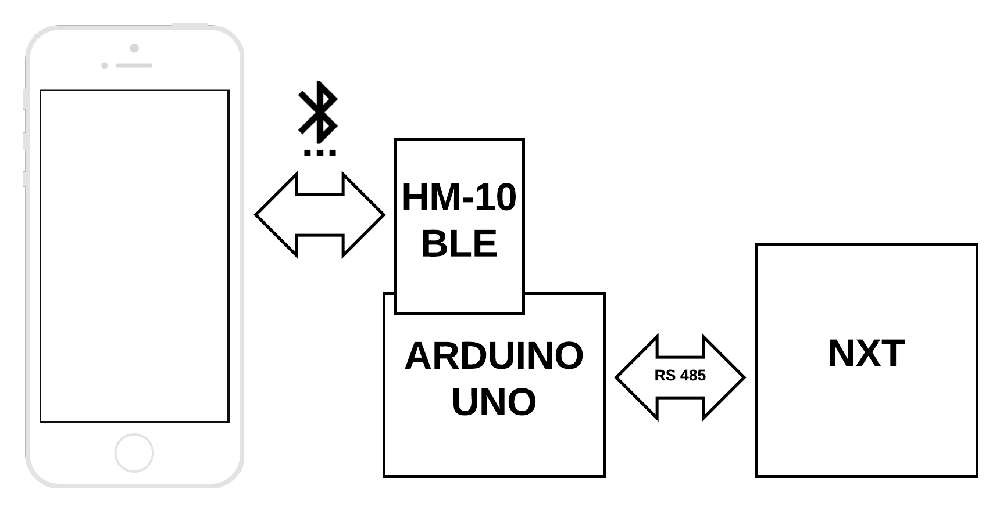

# Hauptseminar Automatisierungstechnik Praktikum: Teil HMI

- [Vorwort](#vorwort)
- [Analyse der Aufgabenstellung](#analyse-der-aufgabenstellung)
  * [HMI Aufgaben](#hmi-aufgaben)
  * [Geplantes Vorgehen](#geplantes-vorgehen)
  * [Schnittstellen mit anderen Modulen](#schnittstellen-mit-anderen-modulen)
- [HMI Entwurf](#hmi-entwurf)
  * [UI Funktionen](#ui-funktionen)
  * [Kommunikationsschema](#kommunikationsschema)
  * [UI Prototyp](#ui-prototyp)
- [HMI Implementierung](#hmi-implementierung)
  * [MAIN VIEW](#main-view)
    + [BLE switch (1)](#ble-switch--1-)
    + [Darstellung der Bahn (2) und Parkflächen (3)](#darstellung-der-bahn--2--und-parkfl-chen--3-)
    + [Parklücken (4)](#parkl-cken--4-)
    + [***PARK_NOW*** (5) und ***SCOUT/PAUSE*** (6) Buttons](#---park-now-----5--und----scout-pause-----6--buttons)
    + [Animation des Pfades (7) und Roboters (99)](#animation-des-pfades--7--und-roboters--99-)
    + [DETAILS VIEW Button (8)](#details-view-button--8-)
  * [DETAILS VIEW](#details-view)
    + [Parking slots (1)](#parking-slots--1-)
    + [Zurückgelegte Strecke (2)](#zur-ckgelegte-strecke--2-)
    + [Status (3)](#status--3-)
    + [Schließen Button (4)](#schlie-en-button--4-)
  * [Shake it](#shake-it)
- [Verbesserungsmöglichkeiten](#verbesserungsm-glichkeiten)

---

# Vorwort

Das Human-Mashine-Interface (weiter HMI) wurde für das iOS entwickelt und aus diesem Grund kann der Quellcode der App, der fürs Android geschrieben ist, nicht benutzt werden. In der Kommunikation müssen auch Änderungen vorgenommen werden, die weiter im Abschnitt [Kommunikationsschema](#kommunikationsschema) besser beschrieben sind.
Diese Dokumentation dient als kurze Beschreibung der Implementierung der HMI-Aufgaben. Um den Inhalt der Dokumentation möglichst kurz halten zu können, wird hier detailliert den Programmierungsteil der App, des Arduino UNO und NXT nicht betrachtet.

---

Abkürzungen:
BLE – Bluetooth Low Energy. UI – User Interface

# Analyse der Aufgabenstellung

## HMI Aufgaben

Die Aufgaben des Moduls beinhalten die Aufgaben zur Steuerung  des Roboters and Darstellung der vom Roboter ausgegangenen Signalen.
Als erstes sollten die Steuerungsbefehle implementiert werden. Die Befehle sind in den Unterlagen des Seminars als ***SCOUT/PAUSE***, ***PARK_NOW*** deklariert.
Das weitere Schritt ist die Darstellung des statischen Parkours mit beweglichem Fahrzeug, gefahrenem Pfad und entdeckten Parklücken auf ihm.
Die wichtigen Daten von Sensoren sollten zur Darstellung von Abstandsvisualisierung und Fahrzeugstatus dienen.
Damit der User, indem er per Touch eine Parklücke ausfindet, dem Roboter aufs Parken hinweisen kann, ist die Touch-Geste-Funktion zu realisieren.

## Geplantes Vorgehen

Bevor mit dem Programmieren anzufangen, ist ein UI Prototyp zu entwickeln. Anhang des Prototyps plant man die Darstellung der UI Elemente und ihre Funktionen.
Als nächstes beginnt man im Xcode mit dem Erstellen des nötigen Projektes und der Layouts. Dann platziert man UI Objekte auf den Layouts und programmiert man die im Controller.
Weiter implementiert man BLE Funktionalität, realisiert RS485 Kommunikation des Arduino UNO und NXT, damit das BLE Modul die Daten bekommen und übergeben kann.
Sobald die Daten in richtiger Form zur App ankommen können, implementiert man die HMI aufgaben zum Parken des Roboters, Zeichnen des Parkours und zur Darstellung der Daten von Sensoren.

## Schnittstellen mit anderen Modulen

Für die Kommunikation mit den anderen Modulen stehen zwei Klassen auf dem NXT zur Verfügung. 
Die Klasse *HmiReaderThread* und zwar die Funktion *processInputs()* liest die Befehle vom User ab und übergibt die Parameter an die zuständigen Variablen, die sich weiter von den anderen Modulen ablesen lassen.
Die Klasse *HmiSenderThread* und zwar die Funktion *processOutputs()* sendet die Daten von Sensoren an die Fernbedienung.

# HMI Entwurf

## UI Funktionen

Im folgenden Bild ist eine vereinfachte schematische Funktionalität des UI Konzepts dargestellt.
Der Ausgang und Eingang werden abstrakt jeweils in einem Datenfluss zusammengefasst.
Aus dem Bild kann man entnehmen, was die Funktionalität des UI ist und was von ihm zu erwarten ist.


## Kommunikationsschema

Die Bluetooth Verbindung zwischen dem NXT und einem iOS Device kann nicht festgestellt werden. Möglicher Grund liegt daran, dass der NXT nicht zertifiziert fürs Benutzen mit iOS Devices ist. Deshalb ist für die Implementierung der Kommunikation ein BLE Modul auf dem Arduino UNO aufzubauen.
Das Kommunikationsschema sieht dann wie folgt aus.



Nach dem folgenden Schema ist das BLE Modul zum Arduino UNO angeschlossen.


## UI Prototyp

Bei der Entwicklung des UI Prototyps dienen als Inspiration die UIs der mobilen Spielen wie PUBG und Apex Legends. Anhand dieser Beispiele kann man besser nachvollziehen, wohin die Haupt- und Nebenelemente besser zu platzieren sind und wie die Information auf dem Bildschirm verteilt werden muss, um den User beim Spielen nicht zu stören.
Für das Prototyp wurde ein Workspace in Adobe XD erstellt, wo UI Elemente platziert und getestet werden können. Im Prototype-Mode des Programms könnte man alle Transaktionen zwischen den Layouts testen und es gibt eine Möglichkeit das Prototyp aufs Handy zu laden und gleich's auf dem Handy zu testen.
Workspace des Projektes im Adobe XD.


---

# HMI Implementierung


Hier sind alle Elemente des UI beschriftet und im folgenden wird deren Implementierung beschrieben.

## MAIN VIEW

### BLE switch (1)

**Funktion:** BLE Verbindung

	Funktion: @IBAction ble(_ sender: UISwitch)
	
	if sender.isOn {
		let alert = UIAlertController(title: "Connect?", message: "Set bluetooth connection to NXT", preferredStyle: .alert)
		alert.addAction(UIAlertAction(title: "Yes", style: .default, handler: {action in
		    self.connect(toPeripheral: (self.myPeripheral!))
		    sender.setOn(false, animated: true)}))
		alert.addAction(UIAlertAction(title: "No", style: .cancel, handler: {action in
		    sender.setOn(false, animated: true)}))
		self.present(alert, animated: true)
	} else {
		let alert = UIAlertController(title: "Disconnect?", message: "Lose bluetooth connection to NXT", preferredStyle: .alert)
		alert.addAction(UIAlertAction(title: "Yes", style: .default, handler: {action in
		    self.disconnect()}))
		alert.addAction(UIAlertAction(title: "No", style: .cancel, handler: {action in
		    sender.setOn(true, animated: true)}))
		self.present(alert, animated: true)
	}
		
Das UI Element Switch steht für die BLE Verbindung. Falls der User den Switch aktivieren möchte, bekommt er eine Meldung mit der Frage ob er die Verbindung feststellen möchte.
Beim aktiven Zustand kann die BLE Verbindung deaktiviert werden, indem man den Switch in den deaktivierten Zustand überführt.
 


---

### Darstellung der Bahn (2) und Parkflächen (3)


Das Parkour und alle statische Elemente des UI wurden proportional zu den realen Abmessungen des Parkours gezeichnet.
Hier entspricht *mes* dem am größten Stück der Bahn, was 7 Rechtecke lang voraussetzt. Weiter werden die nötigen Punkte anhand *start* und *mes* maßstäblich ermittelt und die nötigen UI Elemente auf der Basis der Punkte erstellt.

	Funktion: createObjects()
	*****Darstellung der Bahn und Parkfläche
	
	*****Parkflächen
	let leftArea: CGRect = CGRect(x: start.x-mes*1.5/6, y: start.y---mes*0.5/6, width: mes/6, height: mes*5/6)
	let rightArea: CGRect = CGRect(x: start.x---mes*1.5/6, y: start.y---mes*1.5/6, width: mes/6, height: mes*3/6)
	let buttomArea: CGRect = CGRect(x: start.x, y: start.y---mes*6.5/6, width: mes/3, height: mes/6)
	
	let leftParking = UIView(frame: leftArea)
	let rightParking = UIView(frame: rightArea)
	let buttomParking = UIView(frame: buttomArea)
	
	leftParking.backgroundColor = UIColor.lightGray
	rightParking.backgroundColor = UIColor.lightGray
	buttomParking.backgroundColor = UIColor.lightGray
	
	self.view.addSubview(leftParking)
	self.view.addSubview(rightParking)
	self.view.addSubview(buttomParking)
	
	*****Bahn
	let road = UIBezierPath()
	
	road.move(to: start)
	road.addLine(to: CGPoint(x: start.x, y: start.y---mes))
	road.addLine(to: CGPoint(x: start.x---mes/3, y: start.y---mes))
	road.addLine(to: CGPoint(x: start.x---mes/3, y: start.y---mes*5/6))
	road.addLine(to: CGPoint(x: start.x---mes/6, y: start.y---mes*5/6))
	road.addLine(to: CGPoint(x: start.x---mes/6, y: start.y---mes/6))
	road.addLine(to: CGPoint(x: start.x---mes/3, y: start.y---mes/6))
	road.addLine(to: CGPoint(x: start.x---mes/3, y: start.y))
	road.close()
	
	let roadLayer = CAShapeLayer()
	roadLayer.path = road.cgPath
	roadLayer.fillColor = UIColor.clear.cgColor
	roadLayer.strokeColor = UIColor.lightGray.cgColor
	roadLayer.lineWidth = mes/10
	
	let lineLayer = CAShapeLayer()
	lineLayer.path = road.cgPath
	lineLayer.fillColor = UIColor.clear.cgColor
	lineLayer.strokeColor = UIColor.darkGray.cgColor
	lineLayer.lineWidth = mes/45
	
	view.layer.addSublayer(roadLayer)
	view.layer.addSublayer(lineLayer)

### Parklücken (4)
Als erstes müssen die Koordinaten der Parklücken in den *pt*-Bereich transformiert werden. Dafür steht das Koeffizient *mas = mes/180* zur Hilfe.
Weiter sind alle Koordinaten mit *mas* zu multiplizieren und vom  *start* abgeleitet, weil *start* der Startposition des Roboters auf dem Parkour entspricht.

	Funktion: makeSlots()
		
	let frontSlot = CGPoint(x: DetailsController.frontSlot.x * mas --- start.x, y: DetailsController.frontSlot.y * mas --- start.y)
	let backSlot = CGPoint(x: DetailsController.backSlot.x * mas --- start.x, y: DetailsController.backSlot.y * mas --- start.y)
	let slotIndex = DetailsController.slotIndex.value
	let width: CGFloat = 50
	let height: CGFloat = 50
	
	if slotIndex != 0 {
	    slot = UIButton(type: .system)
	    slot.tag = slotIndex
	    
	    if(frontSlot.x < start.x) {
	        slot.frame = CGRect(x: start.x-mes*1.5/6---mes/50, y: frontSlot.y, width: width, height: backSlot.y-frontSlot.y)
	        makeAppearance(slot: slot)
	    } else if (frontSlot.y > start.y---mes) {
	        slot.frame = CGRect(x: frontSlot.x, y: start.y---mes*6.5/6---mes/50, width: backSlot.x-frontSlot.x, height: height)
	        makeAppearance(slot: slot)
	    } else if (frontSlot.x > start.x---mes/6 && frontSlot.y < start.y---mes*5/6) {
	        slot.frame = CGRect(x: start.x---mes*1.5/6---mes/50, y: backSlot.y, width: width, height: frontSlot.y-backSlot.y)
	        makeAppearance(slot: slot)
	    }
	}
    
Die obere Funktion bekommt die Koordinaten einer Parklücke und erstellt ein UI Element für die.
Und die untere Funktionen gestaltet das UI Element.

	Funktion: makeAppearance(slot: UIButton)
	
	slot.layer.cornerRadius = 10
	slot.backgroundColor = slotBackgroundColor
	slot.setTitleColor(UIColor.black, for: .normal)
	slot.titleLabel!.font = UIFont.boldSystemFont(ofSize: 30)
	
	if DetailsController.slotStatus == 0 {
	    slot.setTitle("P", for: .normal)
	    slot.addTarget(self, action: #selector(parkNow), for: UIControlEvents.touchUpInside)
	} else {
	    slot.setTitle("–", for: .normal)
	    slot.addTarget(self, action: #selector(slotAlert), for: UIControlEvents.touchUpInside)
	}
	
	self.view.addSubview(slot)

In *\#selector(...)* wird eine bestimmte Aktion aufgerufen. Je nachdem, ob die Parklücke *suitable* oder *not_suitable* fürs Parken ist.
Im folgenden sind die Funktionen der Aktionen in *\#selector(...)*.

	Funktion: parkNow(sender: UIButton) 
 
	if myCharasteristic != nil {
	    writeValue(data: Data(_: [0x01, UInt8(sender.tag)]))
	}
	UIButton.animate(withDuration: 0.1, animations: {sender.transform = CGAffineTransform(scaleX: 1.1, y: 1.15)}, completion: {finish in UIButton.animate(withDuration: 0.1, animations: {sender.transform = CGAffineTransform.identity})})

In *parkNow(sender: UIButton)* senden wir ein Byte-Array *writeValue(data: Data(bytes: [0x01, UInt8(sender.tag)])*. In diesem Array ist der erste Parameter immer ein Flag zur Erkennung der Art des Befehles. Die Art des Befehles entspricht der *Enum*-Liste *HmiPLT.Command*.
In diesem Fall entspricht *0x01* *HmiPLT.Command.IN_SELECTED_PARKING_SLOT*. Der zweite Parameter ist *slotID* was unter dem Tag des Buttons gespeichert ist.

	Funktion: slotAlert(sender: UIButton)
	
	let alert = UIAlertController(title: "", message: "This parking slot is to small", preferredStyle: UIAlertController.Style.alert)
	alert.addAction(UIAlertAction(title: "OK", style: UIAlertAction.Style.default, handler: nil))
	self.present(alert, animated: true, completion: nil)

Hier bekommen wir eine Warnung, dass die Parklücke *not_suitable* fürs Parken ist.

### ***PARK_NOW*** (5) und ***SCOUT/PAUSE*** (6) Buttons

Die zwei Buttons sind erstmal im vertikalen Stack zusammengesetzt und dann sind die Stacks Constrains zum Screen View angesetzt.
Das erlaubt, das Stack als ein Objekt zu manipulieren.

Im folgenden sind die Funktionen der Buttons.

	Funktion: @IBAction parking(_ sender: UIButton)

	if myCharasteristic != nil {
	    writeValue(data: writeParkThis)
	}
	UIButton.animate(withDuration: 0.1, animations: {sender.transform = CGAffineTransform(scaleX: 1.1, y: 1.15)}, completion: {finish in UIButton.animate(withDuration: 0.1, animations: {sender.transform = CGAffineTransform.identity})})

In *‌	writeValue(data: writeParkThis)* ist *writeParkThis* ein Array *[0x00, 0x01]*. Der erste Parameter wie bei den Parklücken entspricht in diesem Fall *HmiPLT.Command.IN_SET_MODE* und der Zweite ist *INxtHmi.mode.PARK_NOW‌*.

	Funktion: @IBAction run(_ sender: UIButton) 
	
	if DetailsController.statusIndex.value == 0 {
	    if myCharasteristic != nil {
	        writeValue(data: writePause)
	    }
	} else {
	    if myCharasteristic != nil {
	        writeValue(data: writeScout)
	    }
	}
	UIButton.animate(withDuration: 0.1, animations: {sender.transform = CGAffineTransform(scaleX: 1.1, y: 1.15)}, completion: {finish in UIButton.animate(withDuration: 0.1, animations: {sender.transform = CGAffineTransform.identity})})
    
Hier schickt man Befehle ***SCOUT/PAUSE*** *INxtHmi.mode.SCOUT* bzw. *INxtHmi.mode.PAUSE*‌. Im *HmiReaderThread* werden die Parameter abgelesen und zugeordnet.

---

### Animation des Pfades (7) und Roboters (99)

Als Startpunkt der Animation ist *RXSwift*, was eine reaktive Programmierungsbibliothek ist. Das erlaubt, die Animation als eine Reaktion auf eine Änderung einer Variable auszulösen. Auf die Syntax der *RXSwift* wird genauer im Abschnitt [DETAILS VIEW](#details_view) eingegangen.

Hier werden UI Elemente für die Animation erstellt
	
 	Funktion: createObjects()

	*****Roboter
	robotLayer.frame = CGRect(x: start.x-mes/14, y: start.y-mes/14, width: mes/7, height: mes/7)
	robotLayer.contentsGravity = CALayerContentsGravity.resizeAspect
	robotLayer.contents = UIImage(named: "Robot")?.cgImage
	robotLayer.zPosition = 1
	
	view.layer.addSublayer(robotLayer)
	
	*****Pfad für laufendes Segment
	pathLayer.fillColor = UIColor.clear.cgColor
	pathLayer.strokeColor = UIColor.black.cgColor
	pathLayer.lineCap = .round
	pathLayer.lineWidth = mes/45
	
	view.layer.addSublayer(pathLayer)
	
	*****Pfad für statisches Segment
	pathM.move(to: CGPoint(x: start.x, y: start.y))
	
	pathMLayer.fillColor = UIColor.clear.cgColor
	pathMLayer.strokeColor = UIColor.black.cgColor
	pathMLayer.lineCap = .round
	pathMLayer.lineWidth = mes/45
	
	view.layer.addSublayer(pathMLayer)
 
und in der folgenden Funktion animiert.

	Funktion: animation()
	
	let mas = mes/dia
	
	let to = CGPoint(x: DetailsController.to.x * mas --- start.x, y: DetailsController.to.y * mas --- start.y)
	let from = CGPoint(x: DetailsController.from.x * mas --- start.x, y: DetailsController.from.y * mas --- start.y)
	let durationMove = DetailsController.step/20
	
	let headingTo = -DetailsController.heading * .pi/180
	let headingFrom = -heading * .pi/180
	let durationRot = sqrt((headingTo-headingFrom)*(headingTo-headingFrom))/(2 * .pi) * 4
	
	if(DetailsController.from != DetailsController.to) {
	    
	    let moveAnimation = CABasicAnimation(keyPath: "position")
	    moveAnimation.fromValue = from
	    moveAnimation.toValue = to
	    moveAnimation.duration = durationMove
	    moveAnimation.fillMode = .forwards
	    moveAnimation.isRemovedOnCompletion = false
	    
	    let rotateAnimation = CABasicAnimation(keyPath: "transform.rotation")
	    rotateAnimation.fromValue = headingFrom
	    rotateAnimation.toValue = headingTo
	    rotateAnimation.duration = durationRot
	    rotateAnimation.beginTime = durationMove
	    rotateAnimation.fillMode = .forwards
	    rotateAnimation.isRemovedOnCompletion = false
	
	    print("Heading: \(DetailsController.heading)")
	    let group = CAAnimationGroup()
	    group.animations = [moveAnimation, rotateAnimation]
	    group.duration = durationMove --- durationRot
	    group.fillMode = .forwards
	    group.isRemovedOnCompletion = false
	    robotLayer.add(group, forKey: nil)
	                
	    let path = UIBezierPath()
	
	    path.move(to: from)
	    path.addLine(to: to)
	    
	    pathLayer.path = path.cgPath
	    
	    pathM.addLine(to: from)
	    pathMLayer.path = pathM.cgPath
	
	    let pathAnimation = CABasicAnimation(keyPath: "strokeEnd")
	    pathAnimation.fromValue = 0
	    pathAnimation.toValue = 1
	    pathAnimation.duration = durationMove
	    pathLayer.add(pathAnimation, forKey: nil)
	    
	    heading = DetailsController.heading
	}
	    
Zuerst ordnet man die Anfangs- und Endpunkte im *pt*-Bereich zu und definiert die Funktionen fürs Dauern der Bewegung und der Rotation des Roboters, was in beiden Fällen Strecke über Geschwindigkeit ist.
Danach werden die Animations erstellt und den passenden Sublayers zugeordnet. *Group* Animation besteht aus 2 nacheinander folgenden Animations, die erlaubt, zuerst die Bewegung und danach die Rotation des Roboters schrittweise durchzuführen.

---

### DETAILS VIEW Button (8)
Funktion: Öffnen des DETAILS VIEW
Der Segue wurde im grafischen Interface des Xcode erstellt.


## DETAILS VIEW

Die BLE Eingangsbuffers werden als erstes in *prozessInput(array: [UInt8])* bearbeitet und aufgeteilt.
Die Variablen zur Darstellung des Status, der gefahrenen Strecke und entdeckten Parklücken werden in der *RXSwift* als Observable deklariert und führen einen Kode aus, wenn die aktualisiert werden.

	Funktion: prozessInput(array: [UInt8])
	
	switch Int(array[0]) {
	    case 4:
	        DetailsController.statusIndex.accept(Int(array[1]))
	    case 3:
	        DetailsController.slotStatus = Int(array[1])
	        DetailsController.frontSlot.x = array[3] == 1 ? CGFloat(array[4]) * (-1) : CGFloat(array[4])
	        DetailsController.frontSlot.y = CGFloat(array[5])
	        DetailsController.backSlot.x = array[6] == 1 ? CGFloat(array[7]) * (-1) : CGFloat(array[7])
	        DetailsController.backSlot.y = CGFloat(array[8])
	        DetailsController.slotIndex.accept(Int(array[2]))
	    case 2:
	        DetailsController.to.x = array[1] == 1 ? CGFloat(array[2]) * (-1) : CGFloat(array[2])
	        DetailsController.to.y = array[3] == 1 ? CGFloat(array[4]) * (-1) : CGFloat(array[4])
	        DetailsController.heading = convertHeadingTo360(value: array[5] == 1 ? Double(array[6]) * (-1) : Double(array[6]))
	        DetailsController.step = Double(CGPointDistance(from: DetailsController.from, to: DetailsController.to))
	        DetailsController.distanceSum ---= DetailsController.step
	        DetailsController.distance.accept(DetailsController.distanceSum)
	        DetailsController.from = DetailsController.to
	    default:
	        print("Input index doen't match the input stream...")
	    }

Die Variable *statusIndex*, *slotIndex* und *distance* sind Observable und ändern entsprechende UI Felder.
Im Case 4 wird der Status des Roboters aktualisiert.
Im Case 3 wird der Buffer mit Daten von Parklücken bearbeitet.
Im Case 2 wird der Buffer mit Positionsdaten des Roboters bearbeitet.

---

### Parking slots (1)

Funktion: Anzeige der Anzahl der gefundenen Parklücke.

	Funktion: viewDodLoad()
	
	DetailsController.slotIndex.asObservable()
            .subscribe(onNext: { value in
                if DetailsController.slotIndex.value == 1 {
                    self.slots.text = "\(DetailsController.slotIndex.value) slot"
                } else {
                    self.slots.text = "\(DetailsController.slotIndex.value) slots"
                }
            })
            .disposed(by: bag)
	            
### Zurückgelegte Strecke (2)

Funktion: Anzeige der zurückgelegte Strecke.

	Funktion: viewDodLoad()
	
	DetailsController.distance.asObservable()
            .subscribe(onNext: { value in
                self.distance.text = "\(String(format: "%.01f", DetailsController.distance.value)) cm"
            })
            .disposed(by: bag)
          
### Status (3)

Funktion: Anzeige des Status des Roboters

	Funktion: viewDodLoad()
	
	DetailsController.statusIndex.asObservable()
            .subscribe(onNext: { value in
                switch DetailsController.statusIndex.value {
                case 0:
                    self.status.backgroundColor = UIColor.green
                case 1:
                    self.status.backgroundColor = UIColor.gray
                case 2:
                    self.status.backgroundColor = UIColor.black
                default:
                    self.status.backgroundColor = UIColor.red
                }
            })
            .disposed(by: bag)

Unterordnung der Farben:

|Case |Farbe | Status |
|:--- |:---- |:---- |
|0 | green | DRIVING |
|1 | gray | INACTIVE |
|2 | black | EXIT |
|default | red | ERROR |

### Schließen Button (4)

Function: Schließen des DETAILS VIEW und Rückführung aufs MAIN VIEW
Bei diesem Button ist es wichtig die Prozesse im MAIN VIEW bei der Öffnung und Rückkehr nicht zu unterbrechen.
Dafür ist eine Funktion *unwindToGlobal(segue: UIStoryboardSegue)* zu deklarieren und einen Segue aufs Exit zu setzten.

```
@IBAction func unwindToGlobal(segue: UIStoryboardSegue) {}
```


## Shake it

Function: Zurücksetzung aller dynamischen UI Objekte auf ihre Startpositionen

Schütteln um die Animation zu löschen.


---

# Verbesserungsmöglichkeiten

Refactoring in beiden *Controllers*, bis nur nötige Funktionalität der UI Elemente in den Dateien stehen bleibt.
* BLE Funktionalität als Protokoll erstellen
* Hilfsfunktionen als Protokoll erstellen